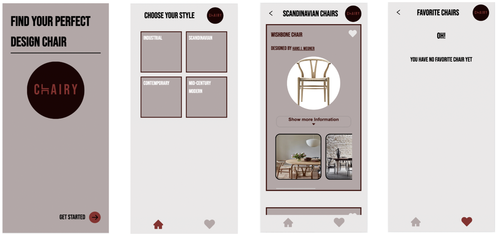

# Chairy
## Find your perfect design chair

This app helps you to find the perfect design chair. You can choose between four different design styles and find more information about the specific chairs. You can also save your liked chairs on the favorite page. 

### Tech Stack
- React
- React Router
- React Testing Library / Jest
- Storybook
- Styled components
- Loacal Storage
- Figma

This project was created with [Create React App](https://create-react-app.dev/docs/getting-started/)

### You can clone this repository
- install all npm dependencies `npm install`
- run app in development mode via `npm run start`
- open http://localhost:3000 to view it in the browser, or you will be asked to confirm another port if this one isn't available.
- to run React Testing Library & Jest `npm run test`
- to run Storybook `npm run storybook`
- Create .env.local file (please check if you have added env.local in your .gitignore)

